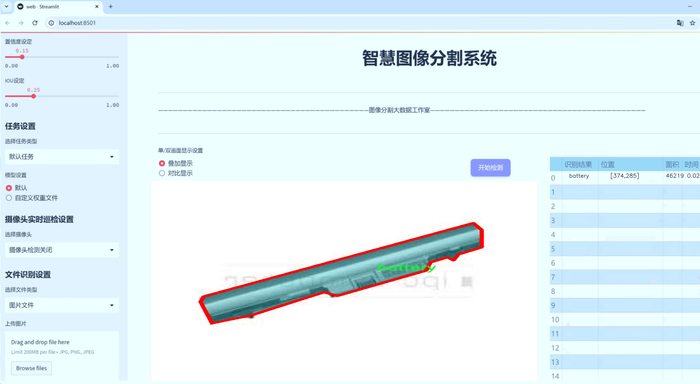
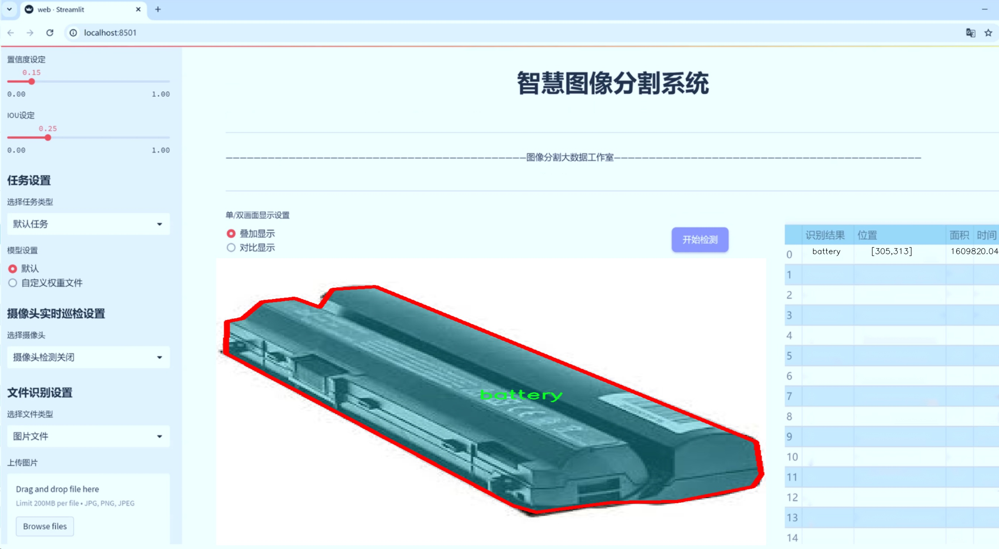
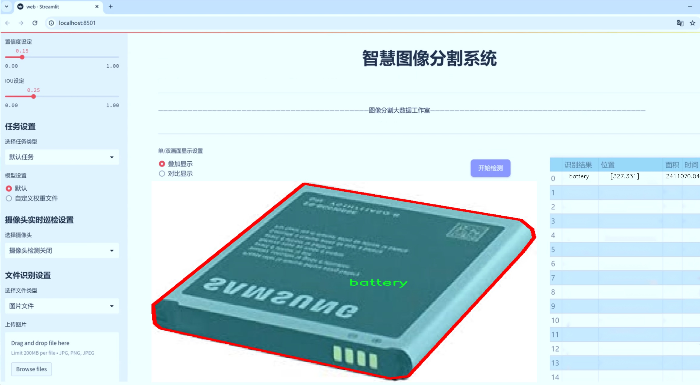
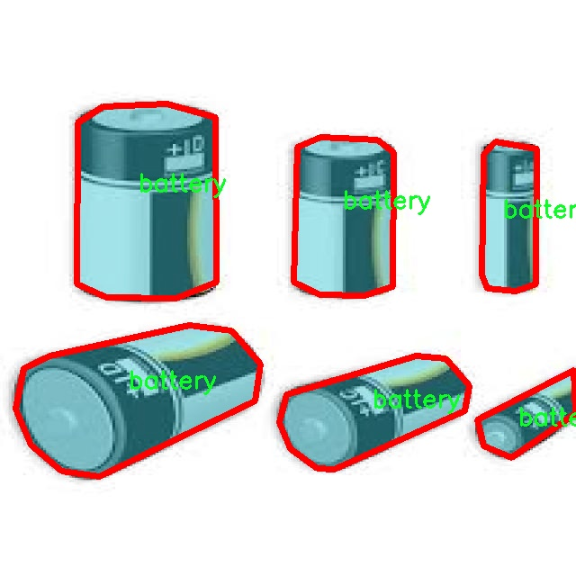
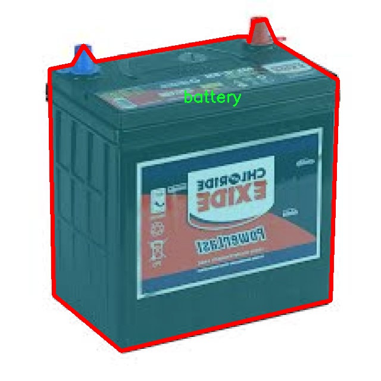
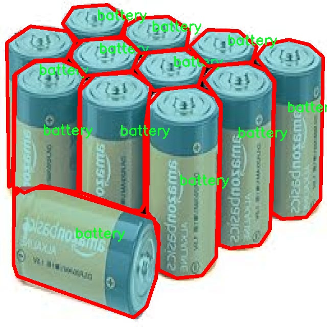
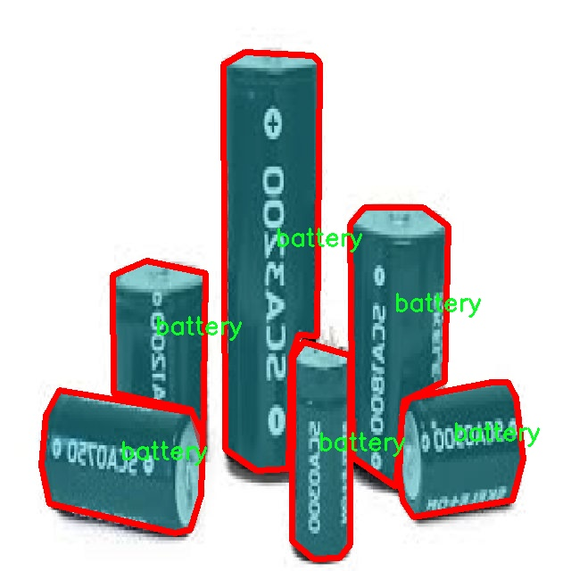
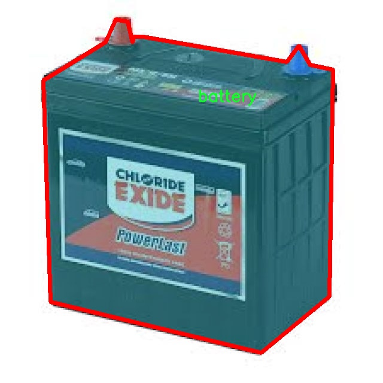

# 垃圾分类图像分割系统源码＆数据集分享
 [yolov8-seg-C2f-EMSC＆yolov8-seg-convnextv2等50+全套改进创新点发刊_一键训练教程_Web前端展示]

### 1.研究背景与意义

项目参考[ILSVRC ImageNet Large Scale Visual Recognition Challenge](https://gitee.com/YOLOv8_YOLOv11_Segmentation_Studio/projects)

项目来源[AAAI Global Al lnnovation Contest](https://kdocs.cn/l/cszuIiCKVNis)

研究背景与意义

随着城市化进程的加快和人口的不断增长，垃圾处理问题日益凸显，成为全球范围内亟待解决的环境问题之一。根据联合国环境规划署的统计，全球每年产生的固体废物数量已超过20亿吨，而这一数字预计将在未来几十年内持续增长。垃圾分类作为一种有效的垃圾管理策略，不仅能够提高资源的回收利用率，减少对环境的污染，还能推动可持续发展。因此，如何高效、准确地进行垃圾分类，尤其是在城市生活中，已成为学术界和工业界关注的热点问题。

在这一背景下，计算机视觉技术的快速发展为垃圾分类提供了新的解决方案。近年来，深度学习尤其是卷积神经网络（CNN）的应用，使得图像识别和分割技术得到了显著提升。YOLO（You Only Look Once）系列模型因其高效的实时检测能力，已成为目标检测领域的主流方法。YOLOv8作为该系列的最新版本，进一步提升了检测精度和速度，适用于复杂环境下的垃圾分类任务。然而，现有的YOLOv8模型在处理细粒度垃圾分类时，仍存在一定的局限性，尤其是在图像分割精度和类别区分能力方面。因此，基于改进YOLOv8的垃圾分类图像分割系统的研究具有重要的理论和实践意义。

本研究旨在构建一个基于改进YOLOv8的垃圾分类图像分割系统，利用9700张图像和12个类别（包括电池、生物垃圾、棕色玻璃、纸板、衣物、绿色玻璃、金属、纸张、塑料、鞋子、垃圾和白色玻璃）的数据集进行训练和测试。通过对YOLOv8模型的改进，增强其在复杂背景下的图像分割能力，力求实现对不同类别垃圾的高效识别与精确分割。这一系统不仅能够提升垃圾分类的自动化水平，还将为智能垃圾分类设备的研发提供重要的技术支持。

此外，垃圾分类的准确性直接影响到后续的垃圾处理和资源回收过程。通过改进YOLOv8模型，使其能够在多种环境条件下保持高效的分类性能，将为城市垃圾管理提供更加智能化的解决方案。研究成果有望推动垃圾分类技术的应用，促进社会公众的环保意识，提高资源的循环利用率，最终实现环境保护与资源节约的双重目标。

综上所述，基于改进YOLOv8的垃圾分类图像分割系统的研究，不仅具有重要的学术价值，也具备广泛的社会应用前景。通过这一研究，我们期望能够为垃圾分类领域的技术进步提供新的思路和方法，为推动可持续发展贡献一份力量。

### 2.图片演示







##### 注意：由于此博客编辑较早，上面“2.图片演示”和“3.视频演示”展示的系统图片或者视频可能为老版本，新版本在老版本的基础上升级如下：（实际效果以升级的新版本为准）

  （1）适配了YOLOV8的“目标检测”模型和“实例分割”模型，通过加载相应的权重（.pt）文件即可自适应加载模型。

  （2）支持“图片识别”、“视频识别”、“摄像头实时识别”三种识别模式。

  （3）支持“图片识别”、“视频识别”、“摄像头实时识别”三种识别结果保存导出，解决手动导出（容易卡顿出现爆内存）存在的问题，识别完自动保存结果并导出到tempDir中。

  （4）支持Web前端系统中的标题、背景图等自定义修改，后面提供修改教程。

  另外本项目提供训练的数据集和训练教程,暂不提供权重文件（best.pt）,需要您按照教程进行训练后实现图片演示和Web前端界面演示的效果。

### 3.视频演示

[3.1 视频演示](https://www.bilibili.com/video/BV1demgYjEJy/)

### 4.数据集信息展示

##### 4.1 本项目数据集详细数据（类别数＆类别名）

nc: 12
names: ['battery', 'biological', 'brown-glass', 'cardboard', 'clothes', 'green-glass', 'metal', 'paper', 'plastic', 'shoes', 'trash', 'white-glass']


##### 4.2 本项目数据集信息介绍

数据集信息展示

在当今环境保护日益受到重视的背景下，垃圾分类作为一种有效的资源回收和环境保护手段，得到了广泛的关注与应用。为了提升垃圾分类的效率与准确性，基于深度学习的图像分割技术逐渐成为研究的热点。为此，本研究选用了名为“waste-classification”的数据集，以训练和改进YOLOv8-seg模型，旨在实现高效的垃圾分类图像分割系统。

“waste-classification”数据集包含12个不同的垃圾类别，涵盖了生活中常见的各类可回收和不可回收物品。这12个类别分别为：电池、生物垃圾、棕色玻璃、纸板、衣物、绿色玻璃、金属、纸张、塑料、鞋子、杂物和白色玻璃。每个类别的选择不仅考虑了其在日常生活中的普遍性，也兼顾了不同材料的回收价值与处理方式。这种多样性使得数据集在训练过程中能够充分模拟实际垃圾分类的复杂场景，从而提升模型的泛化能力。

在数据集的构建过程中，研究团队对每个类别进行了精心的标注和分类，确保数据的准确性和一致性。通过高质量的图像采集和处理，数据集中的每一张图像都清晰地展示了不同类别垃圾的特征，便于模型在训练时进行有效的学习与识别。此外，数据集还包含了多种环境下的垃圾图像，如室内、室外、白天和夜晚等，以增强模型对不同场景的适应能力。这种多样化的训练数据有助于提高YOLOv8-seg模型在实际应用中的表现，使其能够在不同条件下准确识别和分割各类垃圾。

在数据预处理阶段，研究团队对图像进行了标准化处理，包括尺寸调整、色彩增强和噪声去除等，以确保输入数据的一致性和质量。这些预处理步骤不仅提高了模型的训练效率，也为后续的图像分割任务奠定了坚实的基础。同时，为了增强模型的鲁棒性，数据集还采用了数据增强技术，如随机裁剪、旋转和翻转等，进一步丰富了训练样本的多样性。

通过对“waste-classification”数据集的深入分析与应用，研究团队期望能够有效提升YOLOv8-seg模型在垃圾分类图像分割任务中的性能。该数据集的设计与构建充分考虑了实际应用中的各种挑战，力求为垃圾分类的智能化、自动化提供有力的支持。未来，随着模型的不断优化与数据集的扩展，期望能够在更广泛的场景中实现精准的垃圾分类，助力可持续发展的环保目标。











### 5.全套项目环境部署视频教程（零基础手把手教学）

[5.1 环境部署教程链接（零基础手把手教学）](https://www.bilibili.com/video/BV1jG4Ve4E9t/?vd_source=bc9aec86d164b67a7004b996143742dc)


[5.2 安装Python虚拟环境创建和依赖库安装视频教程链接（零基础手把手教学）](https://www.bilibili.com/video/BV1nA4VeYEze/?vd_source=bc9aec86d164b67a7004b996143742dc)

### 6.手把手YOLOV8-seg训练视频教程（零基础小白有手就能学会）

[6.1 手把手YOLOV8-seg训练视频教程（零基础小白有手就能学会）](https://www.bilibili.com/video/BV1cA4VeYETe/?vd_source=bc9aec86d164b67a7004b996143742dc)


按照上面的训练视频教程链接加载项目提供的数据集，运行train.py即可开始训练



     Epoch   gpu_mem       box       obj       cls    labels  img_size
     1/200     0G   0.01576   0.01955  0.007536        22      1280: 100%|██████████| 849/849 [14:42<00:00,  1.04s/it]
               Class     Images     Labels          P          R     mAP@.5 mAP@.5:.95: 100%|██████████| 213/213 [01:14<00:00,  2.87it/s]
                 all       3395      17314      0.994      0.957      0.0957      0.0843

     Epoch   gpu_mem       box       obj       cls    labels  img_size
     2/200     0G   0.01578   0.01923  0.007006        22      1280: 100%|██████████| 849/849 [14:44<00:00,  1.04s/it]
               Class     Images     Labels          P          R     mAP@.5 mAP@.5:.95: 100%|██████████| 213/213 [01:12<00:00,  2.95it/s]
                 all       3395      17314      0.996      0.956      0.0957      0.0845

     Epoch   gpu_mem       box       obj       cls    labels  img_size
     3/200     0G   0.01561    0.0191  0.006895        27      1280: 100%|██████████| 849/849 [10:56<00:00,  1.29it/s]
               Class     Images     Labels          P          R     mAP@.5 mAP@.5:.95: 100%|███████   | 187/213 [00:52<00:00,  4.04it/s]
                 all       3395      17314      0.996      0.957      0.0957      0.0845


### 7.50+种全套YOLOV8-seg创新点代码加载调参视频教程（一键加载写好的改进模型的配置文件）

[7.1 50+种全套YOLOV8-seg创新点代码加载调参视频教程（一键加载写好的改进模型的配置文件）](https://www.bilibili.com/video/BV1Hw4VePEXv/?vd_source=bc9aec86d164b67a7004b996143742dc)

### 8.YOLOV8-seg图像分割算法原理

原始YOLOv8-seg算法原理

YOLOv8-seg算法是YOLO系列的最新进展，旨在为目标检测和实例分割任务提供高效、准确的解决方案。YOLO（You Only Look Once）算法自其诞生以来，就以其独特的框架和高效的处理能力在计算机视觉领域占据了重要地位。YOLOv8的推出不仅延续了这一传统，还在多个方面进行了创新和优化，使其在实际应用中表现出色。

YOLOv8的核心思想依然是将目标检测任务转化为回归问题，通过一个单一的神经网络模型同时预测目标的位置和类别。与之前的版本相比，YOLOv8在模型结构上进行了重要的改进。其网络结构主要由三部分组成：主干网络（backbone）、特征增强网络（neck）和检测头（head）。主干网络采用了CSP（Cross Stage Partial）结构，这种设计使得网络在保持高效性的同时，能够提取更丰富的特征信息。

在特征增强网络方面，YOLOv8引入了PAN-FPN（Path Aggregation Network - Feature Pyramid Network）的思想。这种结构能够有效地融合来自不同层次的特征，使得模型在处理多尺度目标时表现更加优异。通过对特征的多层次融合，YOLOv8能够在不同的尺度上获取目标信息，从而提高检测的准确性和鲁棒性。

YOLOv8的检测头部分是其最大的创新之一。传统的YOLO模型使用耦合头，即分类和回归任务共享同一输出层，而YOLOv8则采用了解耦头，将分类和回归任务分为两个独立的分支。这一设计使得模型在复杂场景下的定位精度和分类准确性得到了显著提升。解耦头的引入，使得每个任务能够更加专注于自身的目标，从而减少了因任务间干扰而导致的错误。

此外，YOLOv8还采用了Anchor-free目标检测方法。这种方法不再依赖于预定义的锚点框，而是通过回归的方式直接预测目标的位置和大小。这一转变不仅简化了模型的设计，还提高了检测的灵活性和适应性。传统的锚点框方法在处理不同尺度和形状的目标时常常面临选择和调整的困难，而YOLOv8的Anchor-free方法则使得网络能够更快地聚焦于目标位置的邻近点，从而使得预测框更接近于实际边界框区域。

YOLOv8的另一个显著特点是其轻量化的设计。相较于之前的YOLO系列，YOLOv8的模型权重文件进一步减小，这使得它能够在各种嵌入式设备上高效运行。这样的设计使得YOLOv8在实时检测场景中表现尤为突出，能够满足快速响应的需求，广泛应用于自动驾驶、安防监控、工业检测等领域。

在训练过程中，YOLOv8采用了新的损失函数，旨在提高模型的训练效果和收敛速度。新的损失函数不仅考虑了分类和回归的精度，还引入了更多的正则化项，以防止过拟合。这一改进使得YOLOv8在各种数据集上的表现更加稳定，尤其是在面对复杂背景和多样化目标时，模型的鲁棒性得到了显著增强。

YOLOv8的应用场景非常广泛，除了传统的目标检测任务外，它还支持实例分割、姿态估计等多种计算机视觉任务。通过对模型结构的灵活调整，YOLOv8能够在高分辨率图像中进行小目标检测，这一特性在许多实际应用中都具有重要意义。例如，在农业领域，YOLOv8可以用于果实的自动识别和采摘，帮助农民提高生产效率；在智能监控中，YOLOv8能够实时检测和跟踪可疑目标，提升安全防范能力。

综上所述，YOLOv8-seg算法通过一系列创新和优化，提升了目标检测和实例分割的性能，成为计算机视觉领域的一项重要技术。其轻量化设计、解耦头结构、Anchor-free方法以及强大的特征融合能力，使得YOLOv8在实时检测任务中表现出色，具有广泛的应用前景。随着YOLOv8的不断发展和完善，未来在各个领域的应用将更加广泛，为智能化和自动化的进程提供强有力的支持。


### 9.系统功能展示（检测对象为举例，实际内容以本项目数据集为准）

图9.1.系统支持检测结果表格显示

  图9.2.系统支持置信度和IOU阈值手动调节

  图9.3.系统支持自定义加载权重文件best.pt(需要你通过步骤5中训练获得)

  图9.4.系统支持摄像头实时识别

  图9.5.系统支持图片识别

  图9.6.系统支持视频识别

  图9.7.系统支持识别结果文件自动保存

  图9.8.系统支持Excel导出检测结果数据


### 10.50+种全套YOLOV8-seg创新点原理讲解（非科班也可以轻松写刊发刊，V11版本正在科研待更新）

#### 10.1 由于篇幅限制，每个创新点的具体原理讲解就不一一展开，具体见下列网址中的创新点对应子项目的技术原理博客网址【Blog】：


[10.1 50+种全套YOLOV8-seg创新点原理讲解链接](https://gitee.com/qunmasj/good)

#### 10.2 部分改进模块原理讲解(完整的改进原理见上图和技术博客链接)【如果此小节的图加载失败可以通过CSDN或者Github搜索该博客的标题访问原始博客，原始博客图片显示正常】
### YOLOv8简介
目前YOLO系列的SOTA模型是ultralytics公司于2023年发布的YOLOv8.按照模型宽度和深度不同分为YOLOv8n、YOLOv8s、YOLOv8m、YOLOv81、YOLOv8x五个版本。本文改进的是 YOLOv8n模型。
YOLOv8的 Backbone采用CSPDarknet结构，它是 Darknet 的一种改进，引入CSP改善网络结构。CSPDarknet把特征图分为两部分，一部分进行卷积操作，另一部分进行跳跃连接，在保持网络深度的同时减少参数量和计算量，提高网络效率。Neck 部分采用特征金字塔PANet[17]，通过自顶向下路径结合和自底向上特征传播进行多尺度融合。损失函数采用了CIloU[18]。YOLOv8的网络结构如图所示。


### ParC融合位置感知循环卷积简介
ParC：Position aware circular convolution


#### Position aware circular convolution
针对于全局信息的提取作者提出了Position aware circular convolution（也称作Global Circular Convolution）。图中左右实际是对于该操作水平竖直两方向的对称，理解时只看左边即可。对于维度为C*H*W的输入，作者先将维度为C*B*1的Position Embedding通过双线性插值函数F调整到适合input的维度C*H*1（以适应不同特征大小输入），并且将PE水平复制扩展到C*H*W维度与输入特征相加。这里作者将PE直接设置成为了可学习的参数。

接下来参考该博客将加入PE的特征图竖直方向堆叠，并且同样以插值的方式得到了适应输入维度的C*H*1大小的卷积核，进行卷积操作。对于这一步卷积，作者将之称为循环卷积，并给出了一个卷积示意图。


但个人感觉实际上这个示意图只是为了说明为什么叫循环卷积，对于具体的计算细节还是根据公式理解更好。


进一步，作者给出了这一步的伪代码来便于读者对这一卷积的理解：y=F.conv2D（torch.cat（xp，xp，dim=2），kV），实际上就是将xp堆叠之后使用了一个“条形（或柱形）”卷积核进行简单的卷积操作。（但这样会导致多一次重复卷积，因此在堆叠示意图中只取了前2*H-1行）

可以看到在示意图中特征维度变化如下：C*(2H-1)*W ---C*H*1--->C*H*W，作者特意带上了通道数，并且并没有出现通道数的改变，那么这里所进行的卷积应该是depth wise卷积，通过对文章后续以及论文源码的阅读可以得知这一步进行的就是DW卷积。（we introduce group convolution and point wise convolution into these modules, which decreases number of parameters without hurting performance.）


由groups = channel可知使用的是DW卷积
通过上面就完成了一次竖直方向的全局信息交流，同样只要在水平方向进行同样的操作即可做到水平方向的全局信息交流。

#### ParC block

通过ParC成功解决了全局信息提取的问题，接下来就是针对2）3）两点进行改进。首先是Meta-Former模块，Meta-Former由Token Mixer和Channel Mixer构成，ParC首先满足了Token Mixer的全局信息提取的要求，并且相较于Attention在计算成本上更低。


这里①中的PWC即point wise conv，进一步验证了我们前面对于深度可分离卷积的想法，而GCC-H/V即是前面所说的ParC-H/V。

①构建了Meta-Former中的Token mixer模块，那么最后剩下的问题就是3），替换掉Attention模块之后模型不再data driven。为了解决这一点作者给出了一个channel wise attention，先将特征图（x,C*H*W）进行global average（a,C*1*1）并输入一个MLP生成一个channel wise的权重（w,C*1*1），再将权重与特征图在通道方向相乘得到输出（output = wx,C*H*W）。

#### ParC net
对于ParC net 的搭建，作者直接基于MobileViT，采用了分叉结构（c）完成了网络的搭建。


具体而言作者保留了MobileViT中浅层具有局部感受野的MobileNetV2结构，而将网络深层的ViT block替换成了ParC block，使网络变成了一个pure ConvNet。


### 11.项目核心源码讲解（再也不用担心看不懂代码逻辑）

#### 11.1 ultralytics\models\yolo\classify\train.py

以下是经过简化和注释的核心代码部分，主要保留了分类训练器的关键功能和结构：

```python
# 导入必要的库
import torch
from ultralytics.data import ClassificationDataset, build_dataloader
from ultralytics.engine.trainer import BaseTrainer
from ultralytics.models import yolo
from ultralytics.nn.tasks import ClassificationModel
from ultralytics.utils import DEFAULT_CFG, LOGGER, RANK, colorstr
from ultralytics.utils.torch_utils import torch_distributed_zero_first

class ClassificationTrainer(BaseTrainer):
    """
    扩展自 BaseTrainer 类，用于基于分类模型的训练。
    """

    def __init__(self, cfg=DEFAULT_CFG, overrides=None, _callbacks=None):
        """初始化 ClassificationTrainer 对象，允许配置覆盖和回调函数。"""
        if overrides is None:
            overrides = {}
        overrides['task'] = 'classify'  # 设置任务类型为分类
        if overrides.get('imgsz') is None:
            overrides['imgsz'] = 224  # 默认图像大小
        super().__init__(cfg, overrides, _callbacks)

    def set_model_attributes(self):
        """从加载的数据集中设置 YOLO 模型的类名。"""
        self.model.names = self.data['names']

    def get_model(self, cfg=None, weights=None, verbose=True):
        """返回配置好的 PyTorch 模型以进行 YOLO 训练。"""
        model = ClassificationModel(cfg, nc=self.data['nc'], verbose=verbose and RANK == -1)
        if weights:
            model.load(weights)  # 加载权重

        for m in model.modules():
            if not self.args.pretrained and hasattr(m, 'reset_parameters'):
                m.reset_parameters()  # 重置参数
            if isinstance(m, torch.nn.Dropout) and self.args.dropout:
                m.p = self.args.dropout  # 设置 dropout
        for p in model.parameters():
            p.requires_grad = True  # 允许训练
        return model

    def build_dataset(self, img_path, mode='train'):
        """根据图像路径和模式（训练/测试等）创建 ClassificationDataset 实例。"""
        return ClassificationDataset(root=img_path, args=self.args, augment=mode == 'train', prefix=mode)

    def get_dataloader(self, dataset_path, batch_size=16, rank=0, mode='train'):
        """返回用于推理的 PyTorch DataLoader，包含图像预处理变换。"""
        with torch_distributed_zero_first(rank):  # DDP 时仅初始化一次数据集
            dataset = self.build_dataset(dataset_path, mode)

        loader = build_dataloader(dataset, batch_size, self.args.workers, rank=rank)
        return loader  # 返回数据加载器

    def preprocess_batch(self, batch):
        """预处理一批图像和类标签。"""
        batch['img'] = batch['img'].to(self.device)  # 将图像移动到设备
        batch['cls'] = batch['cls'].to(self.device)  # 将类标签移动到设备
        return batch

    def final_eval(self):
        """评估训练后的模型并保存验证结果。"""
        for f in self.last, self.best:
            if f.exists():
                if f is self.best:
                    LOGGER.info(f'\nValidating {f}...')
                    self.metrics = self.validator(model=f)  # 验证模型
                    self.metrics.pop('fitness', None)  # 移除不需要的指标
        LOGGER.info(f"Results saved to {colorstr('bold', self.save_dir)}")  # 保存结果信息
```

### 代码说明：
1. **导入库**：导入了必要的 PyTorch 和 Ultralytics 库，用于模型训练和数据处理。
2. **ClassificationTrainer 类**：这是一个分类训练器类，继承自 `BaseTrainer`，用于管理分类模型的训练过程。
3. **初始化方法**：设置任务类型为分类，并定义默认图像大小。
4. **模型属性设置**：从数据集中获取类名并设置到模型中。
5. **模型获取**：根据配置和权重加载模型，并设置参数以进行训练。
6. **数据集构建**：根据给定路径和模式创建数据集实例。
7. **数据加载器获取**：返回处理后的数据加载器，适用于训练或推理。
8. **批处理预处理**：将图像和类标签移动到指定设备（如 GPU）。
9. **最终评估**：在训练结束后评估模型并保存结果。

通过这些核心部分的注释，可以更好地理解代码的功能和结构。

这个文件是一个用于训练分类模型的Python脚本，属于Ultralytics YOLO项目的一部分。它定义了一个名为`ClassificationTrainer`的类，该类继承自`BaseTrainer`，并提供了一系列方法来处理图像分类任务的训练过程。

首先，文件导入了必要的库和模块，包括PyTorch、Torchvision以及Ultralytics提供的各种工具和数据集类。接着，`ClassificationTrainer`类的构造函数初始化了训练器的基本配置，包括任务类型、图像大小等。如果用户没有提供图像大小，默认设置为224。

`set_model_attributes`方法用于从加载的数据集中设置YOLO模型的类名。`get_model`方法则负责返回一个配置好的PyTorch模型，支持加载预训练权重，并根据用户的设置调整模型参数，比如是否使用Dropout。

在`setup_model`方法中，训练器会检查模型的类型，并根据模型的文件名或类型加载相应的YOLO模型或Torchvision模型。如果模型是以`.pt`结尾的文件，使用`attempt_load_one_weight`方法加载模型权重；如果是以`.yaml`或`.yml`结尾的文件，则调用`get_model`方法；如果是Torchvision的模型名称，则直接从Torchvision的模型库中获取。

`build_dataset`方法用于创建一个分类数据集实例，`get_dataloader`方法则返回一个PyTorch的DataLoader，用于在训练过程中加载和预处理图像数据。该方法还支持分布式训练，确保数据集只初始化一次。

`preprocess_batch`方法用于将图像和类标签移动到指定的设备上，通常是GPU。`progress_string`方法返回一个格式化的字符串，用于显示训练进度。

`get_validator`方法返回一个用于验证的实例，`label_loss_items`方法则返回一个包含训练损失项的字典，尽管对于分类任务来说，这个方法并不是必需的。

`plot_metrics`方法用于从CSV文件中绘制训练过程中的指标，`final_eval`方法在训练结束后评估模型并保存验证结果。最后，`plot_training_samples`方法用于绘制训练样本及其注释，以便于可视化训练过程。

整体来看，这个文件提供了一个结构化的框架，用于训练YOLO模型进行图像分类，涵盖了模型加载、数据处理、训练过程管理和结果可视化等多个方面。

#### 11.2 ui.py

以下是经过简化和注释的核心代码部分：

```python
import sys
import subprocess

def run_script(script_path):
    """
    使用当前 Python 环境运行指定的脚本。

    Args:
        script_path (str): 要运行的脚本路径

    Returns:
        None
    """
    # 获取当前 Python 解释器的路径
    python_path = sys.executable

    # 构建运行命令，使用 streamlit 运行指定的脚本
    command = f'"{python_path}" -m streamlit run "{script_path}"'

    # 执行命令，并等待其完成
    result = subprocess.run(command, shell=True)
    
    # 检查命令执行结果，如果返回码不为0，则表示出错
    if result.returncode != 0:
        print("脚本运行出错。")

# 主程序入口
if __name__ == "__main__":
    # 指定要运行的脚本路径
    script_path = "web.py"  # 这里可以替换为实际的脚本路径

    # 调用函数运行脚本
    run_script(script_path)
```

### 代码注释说明：
1. **导入模块**：
   - `sys`：用于获取当前 Python 解释器的路径。
   - `subprocess`：用于执行外部命令。

2. **`run_script` 函数**：
   - 该函数接受一个脚本路径作为参数，并使用当前 Python 环境运行该脚本。
   - 使用 `sys.executable` 获取当前 Python 解释器的路径，以确保使用正确的 Python 版本。
   - 构建命令字符串，使用 `streamlit` 模块运行指定的脚本。
   - 使用 `subprocess.run` 执行命令，并等待其完成。
   - 检查命令的返回码，如果返回码不为0，表示脚本运行出错，打印错误信息。

3. **主程序入口**：
   - 在 `if __name__ == "__main__":` 块中，指定要运行的脚本路径（此处为 `"web.py"`）。
   - 调用 `run_script` 函数来执行指定的脚本。

这个程序文件名为 `ui.py`，主要功能是使用当前的 Python 环境来运行一个指定的脚本，具体是通过 Streamlit 来启动一个 Web 应用。

首先，程序导入了必要的模块，包括 `sys`、`os` 和 `subprocess`。其中，`sys` 模块用于访问与 Python 解释器相关的变量和函数，`os` 模块提供了与操作系统交互的功能，而 `subprocess` 模块则用于创建新进程、连接到它们的输入/输出/错误管道，并获取它们的返回码。此外，还导入了 `abs_path` 函数，这个函数来自于 `QtFusion.path` 模块，可能用于获取文件的绝对路径。

接下来，定义了一个名为 `run_script` 的函数，该函数接受一个参数 `script_path`，表示要运行的脚本的路径。在函数内部，首先获取当前 Python 解释器的路径，这通过 `sys.executable` 实现。然后，构建一个命令字符串，该命令用于运行指定的脚本，具体是通过 `streamlit run` 命令来启动 Web 应用。

使用 `subprocess.run` 方法执行构建好的命令，并通过 `shell=True` 参数在 shell 中运行命令。执行完后，检查返回码，如果返回码不为 0，表示脚本运行出错，程序会打印出相应的错误信息。

在文件的最后部分，使用 `if __name__ == "__main__":` 语句来确保只有在直接运行该脚本时才会执行后面的代码。这里指定了要运行的脚本路径 `script_path`，调用 `abs_path` 函数获取 `web.py` 的绝对路径。最后，调用 `run_script` 函数来执行这个脚本。

总的来说，这个程序的主要目的是为用户提供一个简单的接口，以便通过当前的 Python 环境来启动一个 Streamlit Web 应用。

#### 11.3 ultralytics\utils\callbacks\dvc.py

以下是代码中最核心的部分，并附上详细的中文注释：

```python
# 导入必要的库
from ultralytics.utils import LOGGER, SETTINGS, TESTS_RUNNING, checks

try:
    # 确保没有在运行测试
    assert not TESTS_RUNNING  
    # 确保DVC集成已启用
    assert SETTINGS['dvc'] is True  
    import dvclive  # 导入DVCLive库
    # 检查DVCLive版本
    assert checks.check_version('dvclive', '2.11.0', verbose=True)

    import os
    import re
    from pathlib import Path

    # 创建DVCLive日志实例
    live = None
    _processed_plots = {}  # 存储已处理的图表

    # 训练周期标志，区分最佳模型的最终评估与最后一次验证
    _training_epoch = False

except (ImportError, AssertionError, TypeError):
    dvclive = None  # 如果导入失败，dvclive设为None


def _log_images(path, prefix=''):
    """记录指定路径的图像，使用DVCLive并可选前缀。"""
    if live:  # 如果DVCLive实例存在
        name = path.name
        # 根据批次分组图像，以便在UI中启用滑块
        m = re.search(r'_batch(\d+)', name)
        if m:
            ni = m[1]
            new_stem = re.sub(r'_batch(\d+)', '_batch', path.stem)
            name = (Path(new_stem) / ni).with_suffix(path.suffix)

        live.log_image(os.path.join(prefix, name), path)  # 记录图像


def on_train_epoch_start(trainer):
    """在每个训练周期开始时，将全局变量_training_epoch设置为True。"""
    global _training_epoch
    _training_epoch = True


def on_fit_epoch_end(trainer):
    """在每个训练周期结束时记录训练指标和模型信息，并推进到下一步。"""
    global _training_epoch
    if live and _training_epoch:  # 如果DVCLive实例存在且当前为训练周期
        all_metrics = {**trainer.label_loss_items(trainer.tloss, prefix='train'), **trainer.metrics, **trainer.lr}
        for metric, value in all_metrics.items():
            live.log_metric(metric, value)  # 记录每个指标

        _training_epoch = False  # 结束当前训练周期


def on_train_end(trainer):
    """在训练结束时记录最佳指标、图表和混淆矩阵（如果DVCLive活动）。"""
    if live:
        # 记录最佳指标
        all_metrics = {**trainer.label_loss_items(trainer.tloss, prefix='train'), **trainer.metrics, **trainer.lr}
        for metric, value in all_metrics.items():
            live.log_metric(metric, value, plot=False)

        # 记录验证集的图表和混淆矩阵
        _log_confusion_matrix(trainer.validator)
        live.end()  # 结束DVCLive记录


# 定义回调函数字典
callbacks = {
    'on_train_epoch_start': on_train_epoch_start,
    'on_fit_epoch_end': on_fit_epoch_end,
    'on_train_end': on_train_end} if dvclive else {}
```

### 代码核心部分解释：
1. **导入和初始化**：首先导入必要的库，并进行一些基本的检查以确保DVCLive可以正常使用。
2. **图像记录函数**：`_log_images`函数用于记录图像，支持根据批次分组。
3. **训练周期开始和结束的回调**：`on_train_epoch_start`和`on_fit_epoch_end`函数分别在每个训练周期开始和结束时被调用，用于记录训练指标。
4. **训练结束时的记录**：`on_train_end`函数在训练结束时记录最佳指标和混淆矩阵，确保所有重要的训练信息都被记录下来。

这些核心部分构成了整个训练过程中的日志记录机制，确保在训练过程中能够实时跟踪和记录重要的训练数据。

这个程序文件是Ultralytics YOLO框架中的一个回调模块，主要用于与DVCLive集成，以便在训练过程中记录和可视化模型的训练进度和性能。代码首先导入了一些必要的模块和库，并进行了一些初步的检查，以确保DVCLive的集成是启用的，并且没有在测试环境中运行。

在文件中，定义了一个全局变量`live`，用于存储DVCLive的日志实例，以及一个字典`_processed_plots`，用于跟踪已经处理过的绘图。接下来，定义了一些私有函数来处理图像和绘图的记录。例如，`_log_images`函数用于记录指定路径下的图像，并可以根据批次进行分组，以便在用户界面中使用滑块展示；`_log_plots`函数则用于记录训练过程中的绘图，如果这些绘图尚未被处理过。

`_log_confusion_matrix`函数用于记录混淆矩阵，它从验证器中提取目标和预测值，并使用DVCLive记录混淆矩阵的可视化。

在训练的不同阶段，定义了一系列的回调函数，例如`on_pretrain_routine_start`和`on_pretrain_routine_end`，分别在预训练开始和结束时调用，用于初始化DVCLive日志和记录训练过程中的绘图。在训练开始时，`on_train_start`函数会记录训练参数，而`on_train_epoch_start`函数则在每个训练周期开始时设置一个全局变量，指示当前处于训练周期中。

`on_fit_epoch_end`函数在每个训练周期结束时调用，记录训练指标和模型信息，并处理训练和验证绘图。最后，`on_train_end`函数在训练结束时调用，记录最佳指标、绘图和混淆矩阵，并结束DVCLive的日志记录。

整个模块的最后部分定义了一个字典`callbacks`，将上述回调函数与相应的事件关联起来，以便在训练过程中自动调用这些函数，前提是DVCLive已经成功初始化。通过这种方式，程序能够有效地记录和可视化训练过程中的重要信息，帮助用户更好地理解模型的性能和进展。

#### 11.4 ultralytics\nn\backbone\fasternet.py

以下是经过简化并添加详细中文注释的核心代码部分：

```python
import torch
import torch.nn as nn
from typing import List
from torch import Tensor

class Partial_conv3(nn.Module):
    """
    部分卷积层，用于处理输入特征图的部分通道。
    """

    def __init__(self, dim, n_div, forward):
        super().__init__()
        self.dim_conv3 = dim // n_div  # 被卷积的通道数
        self.dim_untouched = dim - self.dim_conv3  # 未被卷积的通道数
        self.partial_conv3 = nn.Conv2d(self.dim_conv3, self.dim_conv3, 3, 1, 1, bias=False)  # 定义卷积层

        # 根据前向传播方式选择不同的前向传播函数
        if forward == 'slicing':
            self.forward = self.forward_slicing
        elif forward == 'split_cat':
            self.forward = self.forward_split_cat
        else:
            raise NotImplementedError

    def forward_slicing(self, x: Tensor) -> Tensor:
        # 仅用于推理阶段
        x = x.clone()  # 保持原始输入不变，以便后续的残差连接
        x[:, :self.dim_conv3, :, :] = self.partial_conv3(x[:, :self.dim_conv3, :, :])  # 对部分通道进行卷积
        return x

    def forward_split_cat(self, x: Tensor) -> Tensor:
        # 用于训练和推理阶段
        x1, x2 = torch.split(x, [self.dim_conv3, self.dim_untouched], dim=1)  # 按通道分割
        x1 = self.partial_conv3(x1)  # 对分割出的部分通道进行卷积
        x = torch.cat((x1, x2), 1)  # 连接卷积后的通道和未卷积的通道
        return x


class MLPBlock(nn.Module):
    """
    多层感知机（MLP）块，包含卷积层和激活函数。
    """

    def __init__(self, dim, n_div, mlp_ratio, drop_path, layer_scale_init_value, act_layer, norm_layer, pconv_fw_type):
        super().__init__()
        self.dim = dim
        self.mlp_ratio = mlp_ratio
        self.drop_path = nn.Identity() if drop_path <= 0 else nn.Dropout(drop_path)  # 随机丢弃层
        self.n_div = n_div

        mlp_hidden_dim = int(dim * mlp_ratio)  # 隐藏层维度

        # 定义MLP层
        mlp_layer: List[nn.Module] = [
            nn.Conv2d(dim, mlp_hidden_dim, 1, bias=False),
            norm_layer(mlp_hidden_dim),
            act_layer(),
            nn.Conv2d(mlp_hidden_dim, dim, 1, bias=False)
        ]

        self.mlp = nn.Sequential(*mlp_layer)  # 将MLP层组合成序列

        # 定义空间混合层
        self.spatial_mixing = Partial_conv3(dim, n_div, pconv_fw_type)

    def forward(self, x: Tensor) -> Tensor:
        shortcut = x  # 保存输入以便进行残差连接
        x = self.spatial_mixing(x)  # 进行空间混合
        x = shortcut + self.drop_path(self.mlp(x))  # 残差连接
        return x


class FasterNet(nn.Module):
    """
    FasterNet模型，包含多个阶段和块。
    """

    def __init__(self, in_chans=3, num_classes=1000, embed_dim=96, depths=(1, 2, 8, 2), mlp_ratio=2., n_div=4,
                 patch_size=4, patch_stride=4, drop_path_rate=0.1, norm_layer=nn.BatchNorm2d, act_layer=nn.ReLU):
        super().__init__()

        self.num_stages = len(depths)  # 模型阶段数
        self.embed_dim = embed_dim  # 嵌入维度

        # 定义图像分块嵌入层
        self.patch_embed = nn.Conv2d(in_chans, embed_dim, kernel_size=patch_size, stride=patch_stride, bias=False)

        # 构建各个阶段
        stages_list = []
        for i_stage in range(self.num_stages):
            stage = BasicStage(dim=int(embed_dim * 2 ** i_stage), n_div=n_div, depth=depths[i_stage],
                               mlp_ratio=mlp_ratio, drop_path=drop_path_rate)
            stages_list.append(stage)

        self.stages = nn.Sequential(*stages_list)  # 将各个阶段组合成序列

    def forward(self, x: Tensor) -> Tensor:
        x = self.patch_embed(x)  # 进行图像分块嵌入
        for stage in self.stages:
            x = stage(x)  # 逐阶段前向传播
        return x


# 使用示例
if __name__ == '__main__':
    model = FasterNet()  # 实例化FasterNet模型
    inputs = torch.randn((1, 3, 640, 640))  # 创建随机输入
    outputs = model(inputs)  # 前向传播
    print(outputs.size())  # 输出结果的尺寸
```

### 代码说明：
1. **Partial_conv3**: 该类实现了部分卷积，支持两种前向传播方式（切片和拼接）。
2. **MLPBlock**: 该类实现了多层感知机模块，包含卷积、归一化和激活函数，支持残差连接。
3. **FasterNet**: 该类实现了FasterNet模型，包含多个阶段，每个阶段由多个MLPBlock组成，并且实现了图像的分块嵌入。
4. **前向传播**: 在`FasterNet`的`forward`方法中，输入经过分块嵌入后，依次通过各个阶段进行处理。

这个程序文件定义了一个名为 `FasterNet` 的深度学习模型，主要用于图像处理任务。该模型的结构和组件是基于 PyTorch 框架构建的，具体实现了一些高效的卷积操作和特征提取机制。

首先，文件导入了必要的库，包括 PyTorch、YAML 解析库、以及一些深度学习相关的模块。接着，定义了一些基础的模块类，如 `Partial_conv3`、`MLPBlock`、`BasicStage`、`PatchEmbed` 和 `PatchMerging`。这些模块是构建 `FasterNet` 的基础组件。

`Partial_conv3` 类实现了一种特殊的卷积操作，可以选择不同的前向传播方式（切片或拼接），以便在训练和推理时使用。`MLPBlock` 类则实现了一个多层感知机（MLP）模块，结合了空间混合和残差连接的思想。`BasicStage` 类则是由多个 `MLPBlock` 组成的一个阶段，负责处理输入特征。

`PatchEmbed` 和 `PatchMerging` 类用于将输入图像分割成小块（patch）并进行特征嵌入和合并操作。这种处理方式有助于提高模型的效率和性能。

`FasterNet` 类是整个模型的核心，初始化时接收多个参数，包括输入通道数、类别数、嵌入维度、深度、激活函数类型等。它通过构建多个阶段（`BasicStage`）和嵌入层（`PatchEmbed`）来实现特征提取。模型还实现了一个前向传播方法，能够输出不同阶段的特征图，适用于密集预测任务。

此外，文件中还定义了一些函数，如 `update_weight` 用于更新模型权重，`fasternet_t0`、`fasternet_t1` 等函数用于加载不同配置的 `FasterNet` 模型，并可以选择性地加载预训练权重。

最后，在 `__main__` 块中，程序示例了如何创建一个 `FasterNet` 模型实例，并打印出模型的输出特征图的尺寸。这段代码还展示了如何加载模型权重和配置文件。

整体来看，这个文件实现了一个高效的深度学习模型，具有灵活的配置和强大的特征提取能力，适合用于各种计算机视觉任务。

#### 11.5 train.py

以下是经过简化和注释的核心代码部分：

```python
import os
import torch
import yaml
from ultralytics import YOLO  # 导入YOLO模型库

if __name__ == '__main__':  # 确保该模块被直接运行时才执行以下代码
    # 设置训练参数
    workers = 1  # 数据加载的工作进程数
    batch = 8  # 每个批次的样本数量
    device = "0" if torch.cuda.is_available() else "cpu"  # 判断是否使用GPU

    # 获取数据集的yaml配置文件的绝对路径
    data_path = abs_path(f'datasets/data/data.yaml', path_type='current')  

    # 将路径格式转换为Unix风格
    unix_style_path = data_path.replace(os.sep, '/')
    # 获取目录路径
    directory_path = os.path.dirname(unix_style_path)

    # 读取YAML文件，保持原有顺序
    with open(data_path, 'r') as file:
        data = yaml.load(file, Loader=yaml.FullLoader)

    # 修改数据集中训练、验证和测试集的路径
    if 'train' in data and 'val' in data and 'test' in data:
        data['train'] = directory_path + '/train'  # 设置训练集路径
        data['val'] = directory_path + '/val'      # 设置验证集路径
        data['test'] = directory_path + '/test'    # 设置测试集路径

        # 将修改后的数据写回YAML文件
        with open(data_path, 'w') as file:
            yaml.safe_dump(data, file, sort_keys=False)

    # 加载YOLO模型，指定配置文件和预训练权重
    model = YOLO(r"C:\codeseg\codenew\50+种YOLOv8算法改进源码大全和调试加载训练教程（非必要）\改进YOLOv8模型配置文件\yolov8-seg-C2f-Faster.yaml").load("./weights/yolov8s-seg.pt")

    # 开始训练模型
    results = model.train(
        data=data_path,  # 指定训练数据的配置文件路径
        device=device,  # 指定使用的设备
        workers=workers,  # 指定数据加载的工作进程数
        imgsz=640,  # 输入图像的大小
        epochs=100,  # 训练的轮数
        batch=batch,  # 每个批次的样本数量
    )
```

### 代码注释说明：
1. **导入库**：导入必要的库，包括`os`、`torch`、`yaml`和YOLO模型库。
2. **主程序入口**：使用`if __name__ == '__main__':`确保代码块只在直接运行时执行。
3. **设置训练参数**：定义数据加载的工作进程数、批次大小和设备（GPU或CPU）。
4. **数据集路径处理**：获取数据集配置文件的绝对路径，并转换为Unix风格路径。
5. **读取和修改YAML文件**：读取YAML文件，修改训练、验证和测试集的路径，并将修改后的内容写回文件。
6. **加载YOLO模型**：指定模型的配置文件和预训练权重进行加载。
7. **训练模型**：调用`model.train()`方法开始训练，传入数据路径、设备、工作进程数、图像大小、训练轮数和批次大小等参数。

该程序文件 `train.py` 是一个用于训练 YOLO（You Only Look Once）模型的脚本。首先，程序导入了必要的库，包括操作系统库 `os`、深度学习框架 `torch`、YAML 处理库 `yaml`、YOLO 模型库 `ultralytics` 以及用于图形界面的 `matplotlib`。在程序的主入口部分，首先设置了一些训练参数，包括工作进程数 `workers`、批次大小 `batch` 和设备选择 `device`。设备选择会根据当前系统是否支持 CUDA 来决定使用 GPU 还是 CPU。

接下来，程序通过 `abs_path` 函数获取数据集配置文件 `data.yaml` 的绝对路径，并将其转换为 UNIX 风格的路径。然后，程序读取该 YAML 文件并解析其内容。特别地，程序检查 YAML 文件中是否包含训练、验证和测试数据的路径，如果存在，则将这些路径修改为当前目录下的 `train`、`val` 和 `test` 文件夹，并将修改后的内容写回到 YAML 文件中。

在模型加载部分，程序使用 YOLO 的配置文件加载预训练模型。需要注意的是，不同的 YOLO 模型对设备的要求不同，因此如果出现内存不足的错误，可以尝试更换其他模型进行测试。

最后，程序调用 `model.train()` 方法开始训练模型，传入训练数据的配置文件路径、设备、工作进程数、输入图像大小、训练的 epoch 数量以及批次大小等参数。这一系列设置确保了模型能够在指定的条件下进行有效的训练。

#### 11.6 ultralytics\models\yolo\segment\train.py

以下是代码中最核心的部分，并附上详细的中文注释：

```python
from ultralytics.models import yolo
from ultralytics.nn.tasks import SegmentationModel
from ultralytics.utils import DEFAULT_CFG, RANK
from ultralytics.utils.plotting import plot_images, plot_results

class SegmentationTrainer(yolo.detect.DetectionTrainer):
    """
    SegmentationTrainer类扩展了DetectionTrainer类，用于基于分割模型的训练。
    """

    def __init__(self, cfg=DEFAULT_CFG, overrides=None, _callbacks=None):
        """初始化SegmentationTrainer对象，使用给定的参数。"""
        if overrides is None:
            overrides = {}
        overrides['task'] = 'segment'  # 设置任务类型为分割
        super().__init__(cfg, overrides, _callbacks)  # 调用父类构造函数

    def get_model(self, cfg=None, weights=None, verbose=True):
        """返回根据指定配置和权重初始化的SegmentationModel模型。"""
        # 创建SegmentationModel实例，通道数为3，类别数为数据集中类别的数量
        model = SegmentationModel(cfg, ch=3, nc=self.data['nc'], verbose=verbose and RANK == -1)
        if weights:
            model.load(weights)  # 如果提供了权重，则加载权重

        return model  # 返回模型实例

    def get_validator(self):
        """返回用于YOLO模型验证的SegmentationValidator实例。"""
        self.loss_names = 'box_loss', 'seg_loss', 'cls_loss', 'dfl_loss'  # 定义损失名称
        # 创建并返回SegmentationValidator实例
        return yolo.segment.SegmentationValidator(self.test_loader, save_dir=self.save_dir, args=copy(self.args))

    def plot_training_samples(self, batch, ni):
        """创建带有标签和框坐标的训练样本图像的绘图。"""
        plot_images(batch['img'],  # 图像数据
                    batch['batch_idx'],  # 批次索引
                    batch['cls'].squeeze(-1),  # 类别
                    batch['bboxes'],  # 边界框
                    batch['masks'],  # 掩码
                    paths=batch['im_file'],  # 图像文件路径
                    fname=self.save_dir / f'train_batch{ni}.jpg',  # 保存文件名
                    on_plot=self.on_plot)  # 绘图回调

    def plot_metrics(self):
        """绘制训练/验证指标。"""
        plot_results(file=self.csv, segment=True, on_plot=self.on_plot)  # 保存结果图像
```

### 代码说明：
1. **导入必要的模块**：引入YOLO模型、分割模型、默认配置、排名和绘图工具。
2. **SegmentationTrainer类**：继承自DetectionTrainer，专门用于处理分割任务的训练。
3. **初始化方法**：设置任务类型为分割，并调用父类的初始化方法。
4. **获取模型**：根据配置和权重初始化分割模型，并返回该模型。
5. **获取验证器**：创建并返回用于验证的SegmentationValidator实例，同时定义损失名称。
6. **绘制训练样本**：生成包含训练样本图像、标签和框坐标的图像。
7. **绘制指标**：绘制训练和验证过程中的指标，并保存结果图像。

这个程序文件 `train.py` 是用于训练基于 YOLO（You Only Look Once）模型的分割任务的。它扩展了一个名为 `DetectionTrainer` 的类，以便于处理图像分割的特定需求。

首先，文件引入了一些必要的模块和类，包括 YOLO 模型、分割模型、默认配置、排名信息以及用于绘图的工具。接着，定义了一个名为 `SegmentationTrainer` 的类，该类继承自 `DetectionTrainer`，并为图像分割任务提供了额外的功能。

在 `SegmentationTrainer` 的构造函数中，首先检查是否有覆盖的参数，如果没有，则初始化为空字典。然后，将任务类型设置为 'segment'，并调用父类的构造函数以完成初始化。

`get_model` 方法用于返回一个初始化好的分割模型。它接受配置和权重参数，如果提供了权重，则会加载这些权重。这个方法确保模型的通道数为 3（通常是 RGB 图像），并根据数据集的类别数量进行初始化。

`get_validator` 方法返回一个用于验证模型的实例，具体是 `SegmentationValidator`。在这个方法中，还定义了损失名称，包括框损失、分割损失、分类损失和 DFL（Distribution Focal Loss）损失，以便在训练过程中进行监控。

`plot_training_samples` 方法用于创建训练样本图像的可视化，包括标签和边框坐标。它使用 `plot_images` 函数将图像、索引、类别、边框和掩码绘制到指定的文件中，以便于后续分析。

最后，`plot_metrics` 方法用于绘制训练和验证过程中的指标，调用 `plot_results` 函数将结果保存为图像文件，便于查看模型的性能。

总体来说，这个文件为 YOLO 模型的图像分割任务提供了一个完整的训练框架，包含模型初始化、验证、训练样本可视化和性能指标绘制等功能。

### 12.系统整体结构（节选）

### 整体功能和构架概括

Ultralytics YOLO 项目是一个用于目标检测、图像分类、图像分割和姿态估计的深度学习框架。该框架提供了一系列模块和工具，以便于用户快速构建、训练和评估不同类型的计算机视觉模型。项目的整体架构包括模型定义、训练流程、数据处理、回调机制、可视化工具和用户界面等。

1. **模型定义**：包括不同类型的模型（如 YOLO、FasterNet 等），每个模型都具有特定的架构和功能。
2. **训练流程**：提供了训练和验证模型的脚本，支持自定义参数设置、数据加载和模型评估。
3. **数据处理**：包含数据集的处理和增强功能，以提高模型的泛化能力。
4. **回调机制**：集成了回调功能，以便在训练过程中记录和可视化训练进度和性能指标。
5. **可视化工具**：提供了绘图和可视化功能，帮助用户理解模型的训练过程和结果。
6. **用户界面**：通过 Streamlit 提供简单的用户界面，方便用户与模型进行交互。

### 文件功能整理表

| 文件路径                                          | 功能描述                                                   |
|--------------------------------------------------|----------------------------------------------------------|
| `ultralytics/models/yolo/classify/train.py`     | 训练 YOLO 分类模型，包含模型初始化、数据处理和训练过程管理。 |
| `ui.py`                                          | 启动 Streamlit Web 应用，用于与模型进行交互。                |
| `ultralytics/utils/callbacks/dvc.py`           | 集成 DVCLive，用于记录和可视化训练过程中的指标和图像。       |
| `ultralytics/nn/backbone/fasternet.py`         | 定义 FasterNet 模型及其组件，用于高效的特征提取。            |
| `train.py`                                       | 训练 YOLO 模型的主脚本，负责加载数据和模型，启动训练过程。    |
| `ultralytics/models/yolo/segment/train.py`     | 训练 YOLO 分割模型，扩展了检测训练器以支持图像分割任务。      |
| `ultralytics/utils/instance.py`                 | 提供实例化相关的工具和函数，可能用于模型或数据集的管理。      |
| `ultralytics/models/yolo/pose/train.py`         | 训练 YOLO 姿态估计模型，处理姿态估计特定的训练需求。          |
| `ultralytics/utils/errors.py`                   | 定义自定义错误和异常处理，确保程序的健壮性。                  |
| `ultralytics/engine/results.py`                 | 处理模型评估结果，提供结果的存储和可视化功能。                |
| `web.py`                                         | 运行 Web 应用，提供用户界面以展示模型的功能和结果。            |
| `ultralytics/nn/autobackend.py`                 | 自动后端管理，可能涉及模型的后端配置和管理。                  |
| `ultralytics/trackers/basetrack.py`             | 实现基本的跟踪算法，用于目标跟踪任务。                        |

以上表格总结了各个文件的主要功能，帮助理解 Ultralytics YOLO 项目的整体架构和各个模块之间的关系。

注意：由于此博客编辑较早，上面“11.项目核心源码讲解（再也不用担心看不懂代码逻辑）”中部分代码可能会优化升级，仅供参考学习，完整“训练源码”、“Web前端界面”和“50+种创新点源码”以“14.完整训练+Web前端界面+50+种创新点源码、数据集获取”的内容为准。

### 13.图片、视频、摄像头图像分割Demo(去除WebUI)代码

在这个博客小节中，我们将讨论如何在不使用WebUI的情况下，实现图像分割模型的使用。本项目代码已经优化整合，方便用户将分割功能嵌入自己的项目中。
核心功能包括图片、视频、摄像头图像的分割，ROI区域的轮廓提取、类别分类、周长计算、面积计算、圆度计算以及颜色提取等。
这些功能提供了良好的二次开发基础。

### 核心代码解读

以下是主要代码片段，我们会为每一块代码进行详细的批注解释：

```python
import random
import cv2
import numpy as np
from PIL import ImageFont, ImageDraw, Image
from hashlib import md5
from model import Web_Detector
from chinese_name_list import Label_list

# 根据名称生成颜色
def generate_color_based_on_name(name):
    ......

# 计算多边形面积
def calculate_polygon_area(points):
    return cv2.contourArea(points.astype(np.float32))

...
# 绘制中文标签
def draw_with_chinese(image, text, position, font_size=20, color=(255, 0, 0)):
    image_pil = Image.fromarray(cv2.cvtColor(image, cv2.COLOR_BGR2RGB))
    draw = ImageDraw.Draw(image_pil)
    font = ImageFont.truetype("simsun.ttc", font_size, encoding="unic")
    draw.text(position, text, font=font, fill=color)
    return cv2.cvtColor(np.array(image_pil), cv2.COLOR_RGB2BGR)

# 动态调整参数
def adjust_parameter(image_size, base_size=1000):
    max_size = max(image_size)
    return max_size / base_size

# 绘制检测结果
def draw_detections(image, info, alpha=0.2):
    name, bbox, conf, cls_id, mask = info['class_name'], info['bbox'], info['score'], info['class_id'], info['mask']
    adjust_param = adjust_parameter(image.shape[:2])
    spacing = int(20 * adjust_param)

    if mask is None:
        x1, y1, x2, y2 = bbox
        aim_frame_area = (x2 - x1) * (y2 - y1)
        cv2.rectangle(image, (x1, y1), (x2, y2), color=(0, 0, 255), thickness=int(3 * adjust_param))
        image = draw_with_chinese(image, name, (x1, y1 - int(30 * adjust_param)), font_size=int(35 * adjust_param))
        y_offset = int(50 * adjust_param)  # 类别名称上方绘制，其下方留出空间
    else:
        mask_points = np.concatenate(mask)
        aim_frame_area = calculate_polygon_area(mask_points)
        mask_color = generate_color_based_on_name(name)
        try:
            overlay = image.copy()
            cv2.fillPoly(overlay, [mask_points.astype(np.int32)], mask_color)
            image = cv2.addWeighted(overlay, 0.3, image, 0.7, 0)
            cv2.drawContours(image, [mask_points.astype(np.int32)], -1, (0, 0, 255), thickness=int(8 * adjust_param))

            # 计算面积、周长、圆度
            area = cv2.contourArea(mask_points.astype(np.int32))
            perimeter = cv2.arcLength(mask_points.astype(np.int32), True)
            ......

            # 计算色彩
            mask = np.zeros(image.shape[:2], dtype=np.uint8)
            cv2.drawContours(mask, [mask_points.astype(np.int32)], -1, 255, -1)
            color_points = cv2.findNonZero(mask)
            ......

            # 绘制类别名称
            x, y = np.min(mask_points, axis=0).astype(int)
            image = draw_with_chinese(image, name, (x, y - int(30 * adjust_param)), font_size=int(35 * adjust_param))
            y_offset = int(50 * adjust_param)

            # 绘制面积、周长、圆度和色彩值
            metrics = [("Area", area), ("Perimeter", perimeter), ("Circularity", circularity), ("Color", color_str)]
            for idx, (metric_name, metric_value) in enumerate(metrics):
                ......

    return image, aim_frame_area

# 处理每帧图像
def process_frame(model, image):
    pre_img = model.preprocess(image)
    pred = model.predict(pre_img)
    det = pred[0] if det is not None and len(det)
    if det:
        det_info = model.postprocess(pred)
        for info in det_info:
            image, _ = draw_detections(image, info)
    return image

if __name__ == "__main__":
    cls_name = Label_list
    model = Web_Detector()
    model.load_model("./weights/yolov8s-seg.pt")

    # 摄像头实时处理
    cap = cv2.VideoCapture(0)
    while cap.isOpened():
        ret, frame = cap.read()
        if not ret:
            break
        ......

    # 图片处理
    image_path = './icon/OIP.jpg'
    image = cv2.imread(image_path)
    if image is not None:
        processed_image = process_frame(model, image)
        ......

    # 视频处理
    video_path = ''  # 输入视频的路径
    cap = cv2.VideoCapture(video_path)
    while cap.isOpened():
        ret, frame = cap.read()
        ......
```


### 14.完整训练+Web前端界面+50+种创新点源码、数据集获取


# [下载链接：https://mbd.pub/o/bread/Zp2Ulpdy](https://mbd.pub/o/bread/Zp2Ulpdy)